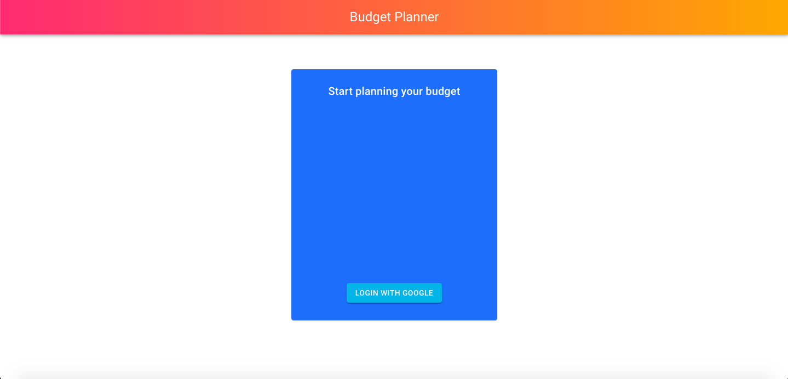
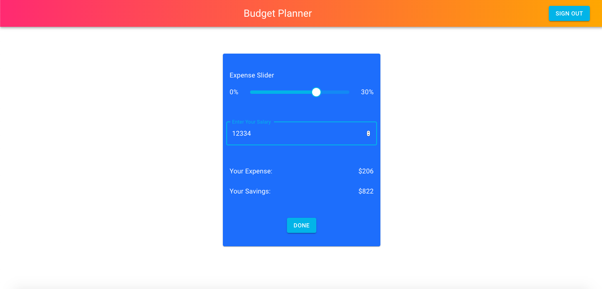
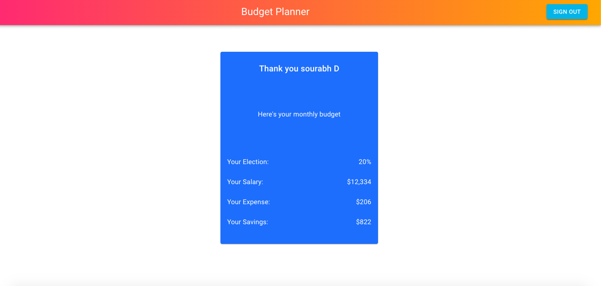
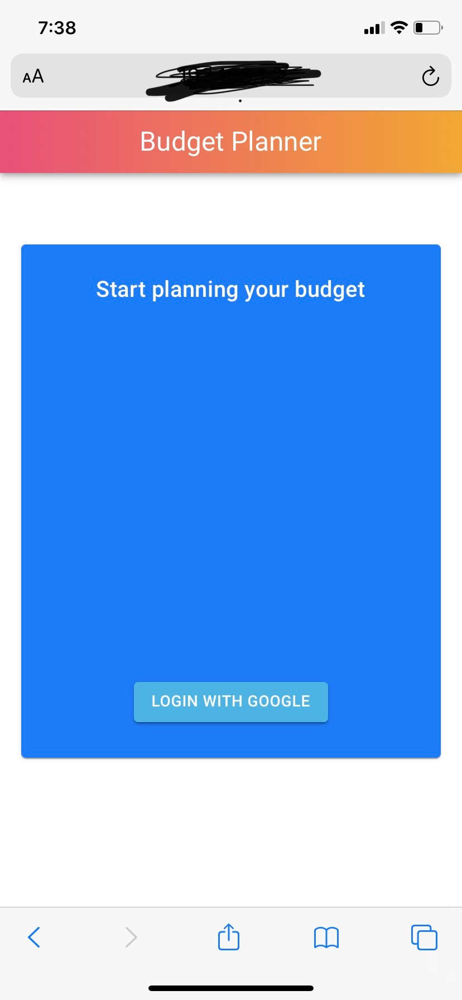
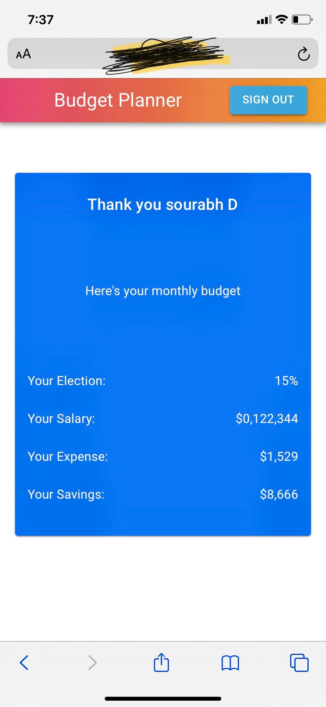
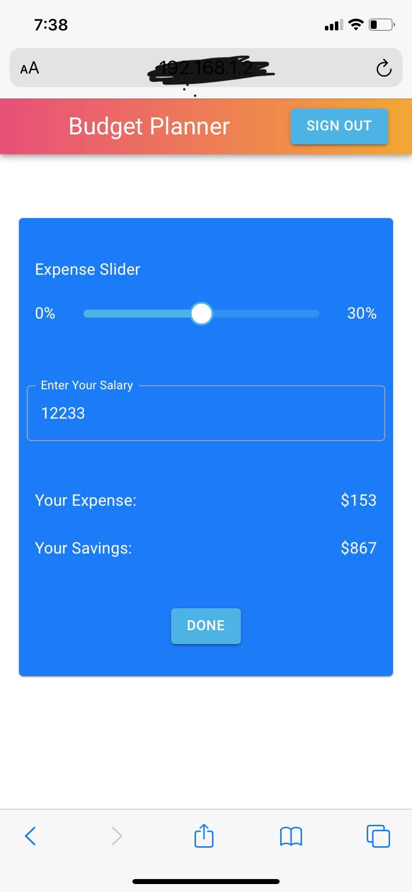

This project was bootstrapped with [Create React App](https://github.com/facebook/create-react-app).

## Available Scripts

In the project directory, you can run:

### `npm run buildandstart` or `yarn buildandstart`

Builds the npm install and Runs the app in the development mode and shoud open up in default browser. 
Open [http://localhost:3000](http://localhost:3000) to view it in the browser if it doesn't automoatically open.

### `Archtectural choices`

* Used firebase authentication for google signin
* TypeScript for its static typechecking
* Redux for state management 
* Customizable components using Material-UI

### `Desktop Browser Screens`

### `Mobile Browser Screens`

